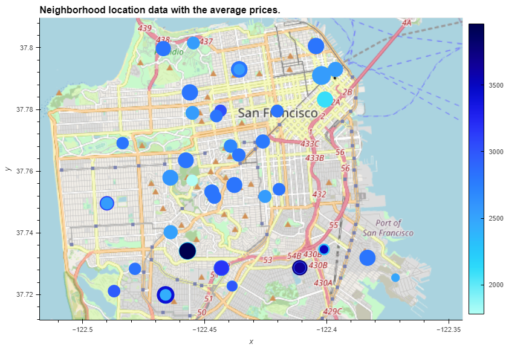

# Housing-Rental-Analysis-for-San-Francisco

A Jupyter notebook that contains analysis of the housing rental market data for San Francisco. The analysis is completed with professionally styled and formatted interactive visualizations.

---

## Approach

Data Visualization with numerical and visual aggregations using PyViz.

---

## Technologies

This project leverages the following tools for financial analysis:

* [Conda](https://docs.conda.io/en/latest/) - source package management system and environment management system.

* [Pandas](https://pandas.pydata.org) - Python library that’s designed specifically for data analysis.

* [JupyterLab](https://jupyter.org) - For running and review Python-based programs.

* [PyViz - hvPlot](https://hvplot.holoviz.org) - a high-level plotting API.

* [PyViz - Geoviews](https://geoviews.org) - to explore and visualize geographical datasets.

---

## Input data

Input data contains information for San Francisco:

* /Resources/sfo_neighborhoods_census_data.csv - statistical data of sale prices and gross rent by neighborhoods  from 2010 to 2016
* /Resources/neighborhoods_coordinates.csv - neighborhoods coordinates

## How to run analysis

1. Install ```conda install -c pyviz hvplot geoviews```
2. Open file "san_francisco_housing.ipynb" with [JupyterLab](https://jupyter.org).
3. Run Notebook.

## Calculate and Plot the Housing Units per Year

```
	sale_price_sqr_foot	housing_units	gross_rent
year			
2010	369.344353	        372560	       1239
2011	341.903429	        374507	       1530
2012	399.389968	        376454	       2324
2013	483.600304	        378401	       2971
2014	556.277273	        380348	       3528
2015	632.540352	        382295	       3739
2016	697.643709	        384242	       4390
```


The over trend is that it increases over time approximately on 0.52%.

## Calculate and Plot the Average Sale Prices per Square Foot

### Style and format the line plot
```
prices_square_foot_by_year.hvplot.line(
    xlabel = "Year",
    ylabel = "Gross Rent / Sale Price Per Square Foot",
    width=700, 
    height=300,
    title = "Sale Price Per Square Foot and Average Gross Rent - 2010-2016 - San Francisco"
)
```


Based on data, there was a drop in the average sale price per square foot in 2011 (from 369.344353 to 341.903429)
The gross slightly decreased in 2011 but it was still higher than in 2010.

## Compare the Average Sale Prices by Neighborhood

### Style and format the line plot
```
prices_by_year_by_neighborhood.hvplot.line(
    x = "year",
    xlabel = "Year",
    ylabel = "Gross Rent / Sale Price Per Square Foot",
    width=700, 
    height=300,
    groupby = "neighborhood",
    title = "Sale Price Per Square Foot and Average Gross Rent - 2010-2016 - San Francisco"
)
```


Based on line plot, we sure that the average sale price per square foot for 2016 (88402) is significattly less than in 2012 (344491).

## Build an Interactive Neighborhood Map

### Style and format the line plot
```
all_neighborhoods_df.hvplot.points(
    'Lon',
    'Lat',
    geo=True,
    size='sale_price_sqr_foot',
    color='gross_rent',
    frame_width=700,
    frame_height=500,
    title='Neighborhood location data with the average prices.',
    tiles='OSM'
)
```



Based on interactive map, Westwood Park has the highest gros rent and Union Square District has the highest sale price per square foot.

Based on the analysis, there is a certain trend in which the cost of sale and rent depends on the San Francisco area. For example, in downtown San Francisco, sales are higher, but in other areas that are further from the downtown, prices begin to decrease. However, rental yields are higher in prime areas, but the price per square foot is substantially lower.

I would suggest that the company buy housing for subsequent rent in residential areas, where housing is most in demand. Because this housing will always be in demand. Housing in downtown is expensive, but the price of rent is not so high, so the purchase does not make sense.

---

## Contributors

Vladislav Glupak - [Linkedin](https://www.linkedin.com/in/vladislav-glupak/)

---

## License

It is an Open-source analysis.
